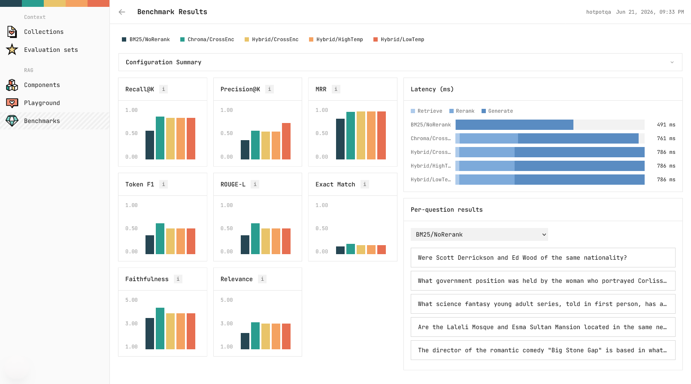
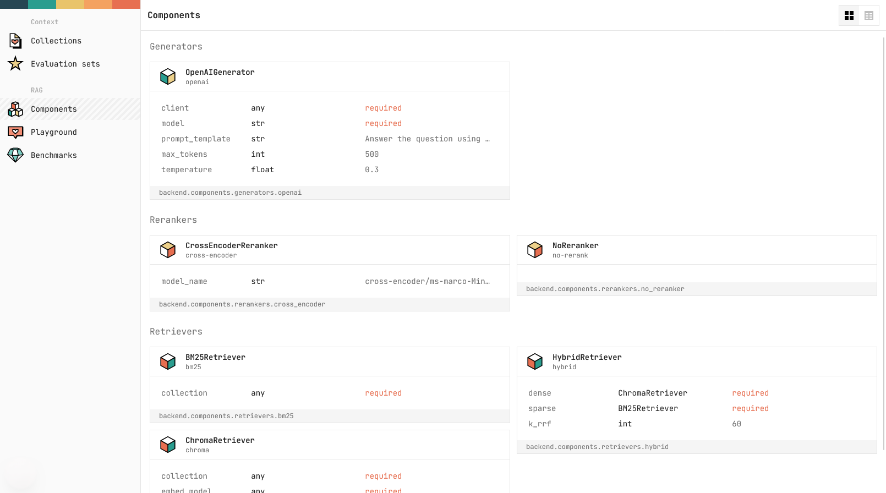
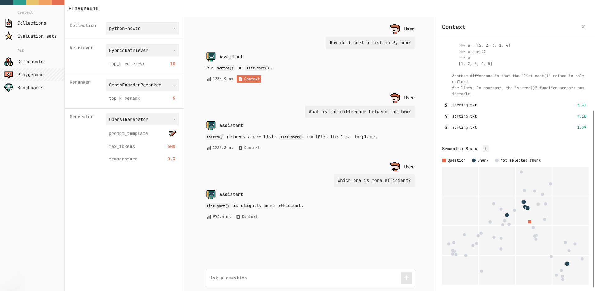
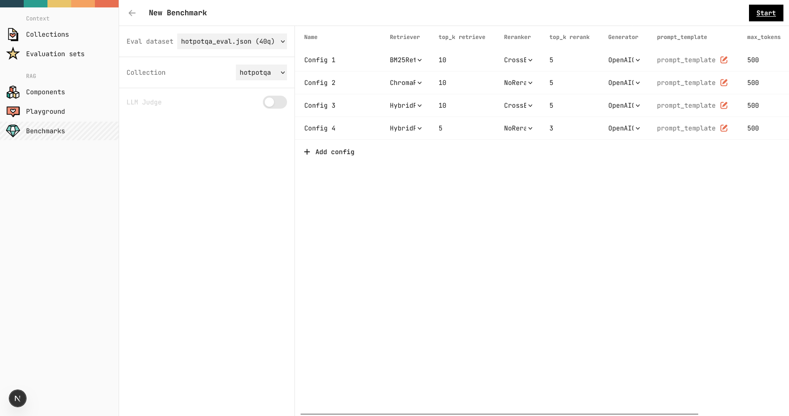
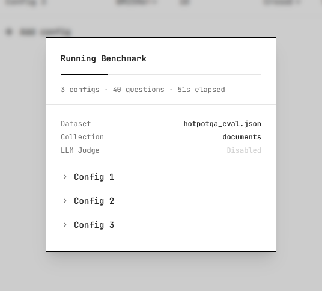

# RAG Benchmark Lab

A tool for benchmarking RAG (Retrieval-Augmented Generation) pipeline configurations side by side. You can swap retrievers, rerankers, and LLM-generators, and compare their performance.

## Screenshots

<div align="center">
<table>
<tr>
<td></td>
</tr>
</table>
<table>
<tr>
<td style="width:50%"></td>
<td style="width:50%"></td>
</tr>
</table>
<table>
<tr>
<td style="width:50%"></td>
<td style="width:50%"></td>
</tr>
</table>

</div>

## Setup

### 1. Install dependencies

You can install the required dependencies from `requirements.txt` using `npm`:

```bash
npm run setup
```

### 2. Configure environment variables

Copy the template from `env.example` and fill in the required fields:

```env
# LLM information (any OpenAI-compatible API)
LLM_API_KEY=your_api_key
LLM_BASE_URL=https://api.mistral.ai/v1
LLM_MODEL_NAME=mistral-medium-3.5

# HUGGING FACE (Optional, allows for higher rate limits)
HF_TOKEN=your_hf_access_token
```

Any LLM API that follows the OpenAI SDK format is supported.

### 3. Start the app

Start the backend and frontend servers individually:

```bash
npm run backend # Start FastAPI backend (http://localhost:8000)
npm run frontend # Start Next.js frontend (http://localhost:3000)
```

Then open the app on [http://localhost:3000](http://localhost:3000).

## Usage

The app is organized into five sections:

###  Collections

Lists all your datasets in ChromaDB. Click **New collection** to vectorize and ingest a new dataset.

###  Evaluation sets

Browse the `.json` evaluation files stored in the `evaluation/` folder. Each file is a list of question/answer pairs used as ground truth when running benchmarks. For example:

```json
[
  {
    "question": "What is X?",
    "answer": "X is ...",
    "contexts": [
      "X has many ...",
      "X is known for ..."
    ]
  },
  ...
]
```

###  Components

A read-only registry of all available pipeline components, auto-discovered from the `backend/components/` subpackages. Components are grouped by category:

| Category   | Default components                          |
| ---------- | ------------------------------------------- |
| Retrievers | BM25, Chroma (dense), Hybrid (BM25 + dense) |
| Rerankers  | Cross-Encoder, No-rerank (passthrough)      |
| Generators | OpenAI-SDK                                  |

Adding a new component class to the appropriate subpackage (e.g. `backend/components/retrievers/`) makes it appear here automatically, and allows you to use it in the playground or for benchmarking.

###  Playground

An interactive query runner. First select a collection from your vector store, retriever, reranker, and generator. Then query your RAG-pipeline to see its generated answer along with the retrieved chunks, latency, and a 2D PCA scatter plot of the query against its semantic neighbourhood in the vector store.

###  Benchmarks

Run and review RAG benchmarks for multiple configurations at once. Pick an evaluation dataset from the `evaluation/` folder, choose a collection, add one or more pipeline configurations, and optionally enable LLM-as-judge scoring. Results are saved automatically to the `benchmarks/` folder.

## Architecture

```
├── api/            # FastAPI backend (port 8000)
│   └── main.py
├── backend/        # Python library (components, metrics, pipeline core)
│   ├── components/ # Retrievers, rerankers, generators + registry
│   ├── core/       # RAGPipeline, BenchmarkRunner, types
│   ├── datasets/   # EvalDataset loader
│   └── metrics/    # ROUGE, retrieval metrics, LLM-as-judge
├── frontend/       # Next.js web UI (port 3000)
├── evaluation/     # Evaluation dataset files (.json)
├── benchmarks/     # Saved benchmark results (.json, auto-created)
└── chroma_db/      # Persistent ChromaDB vector store (auto-created)
```
