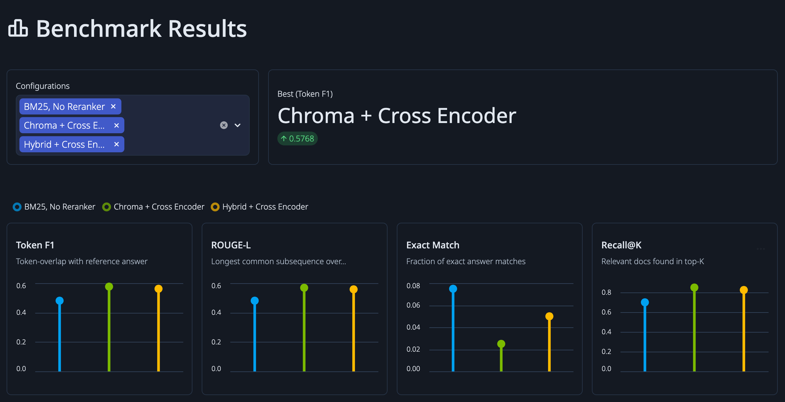
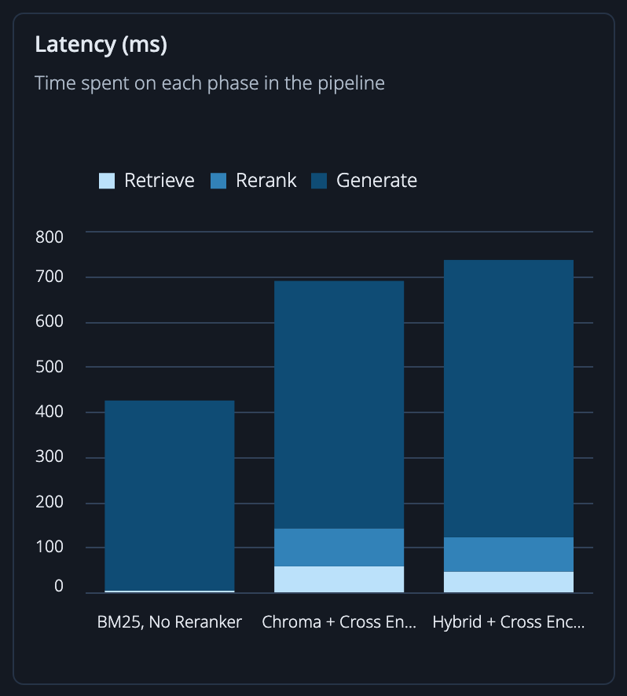
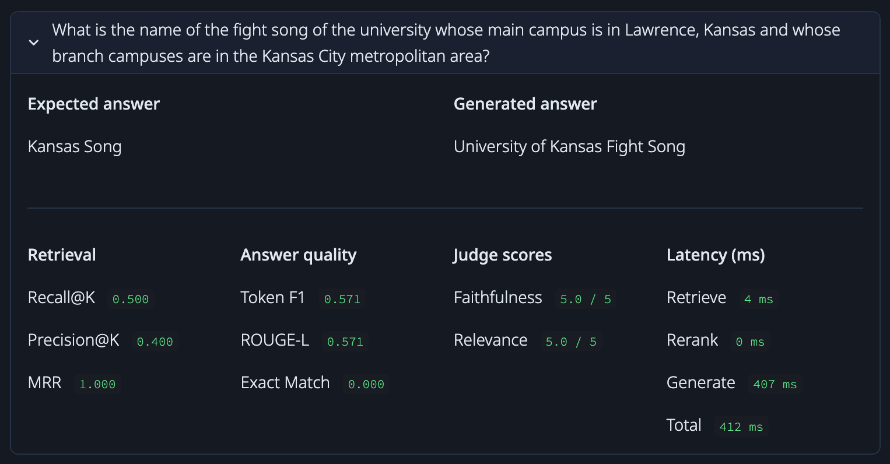

# RAG Benchmark Lab

A framework for benchmarking RAG (Retrieval-Augmented Generation) pipeline configurations side by side. You can swap retrievers, rerankers, and LLM-generators, and compare their performance.

## Screenshots


<div align="center">
<table>
<tr>
<td style="width:33%"></td>
<td style="width:67%"></td>
</tr>
</table>
</div>

## Setup

### 1. Install dependencies

You can install the required dependencies from `requirements.txt`:

```bash
pip install -r requirements.txt
```

### 2. Configure environment variables

Copy the template from `env.example` and fill in the required fields:

```env
# LLM information (For using OpenAI API: https://developers.openai.com/api/docs)
LLM_API_KEY=your_api_key
LLM_BASE_URL=https://api.mistral.ai/v1
LLM_MODEL_NAME=mistral-medium-3.5

# HUGGING FACE (Optional, allows for higher rate limits)
HF_TOKEN=your_hf_access_token
```

Any LLM API is supported that follows the OpenAI SDK format.

## Usage

### 1. Populate ChromaDB vector database

### 2. Set up RAG configuration(s)

Define your RAG components (retrievers, generators etc.) and combine them into `PipelineConfig` objects. The benchmark will run for each configuration.

```python
# Components
hybrid_ret  = rb.HybridRetriever()
reranker    = rb.CrossEncoderReranker()
generator   = rb.OpenAIGenerator(client, model)
judge       = rb.LLMJudge(client, model)

# Configs
configs = [
    rb.PipelineConfig(
        name="Hybrid + Cross Encoder",
        retriever=hybrid_ret,
        reranker=reranker,
        generator=generator,
        top_k_retrieve=args.top_k,
        top_k_rerank=args.rerank_k,
    )
    # Add more configurations
  ]

# Run
runner  = rb.BenchmarkRunner(dataset, judge=judge)
```

### 3. Run benchmark

```bash
python bench.py --eval-dataset eval.json --export results.json
```

Add `--judge` to enable LLM-as-judge evaluation. See below for a full list of arguments:

**Benchmark arguments**

| Flag             | Default        | Description                                    |
| ---------------- | -------------- | ---------------------------------------------- |
| `--eval-dataset` | required       | Path to evaluation dataset (`.json` or `.csv`) |
| `--collection`   | `documents`    | ChromaDB collection name                       |
| `--top-k`        | `10`           | Chunks to retrieve before reranking            |
| `--rerank-k`     | `5`            | Chunks passed to the generator                 |
| `--judge`        | off            | Enable LLM-as-judge scoring                    |
| `--export`       | `results.json` | Save results to a `.json` file                 |

### 4. View dashboard

After the benchmark finished, run the below command to start a Streamlit dashboard:

```bash
streamlit run dashboard.py [exported_benchmark_file]
```
